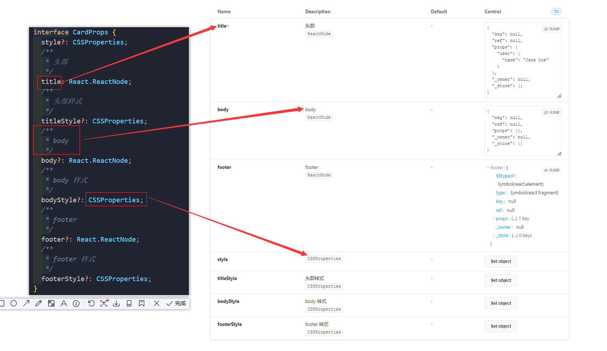
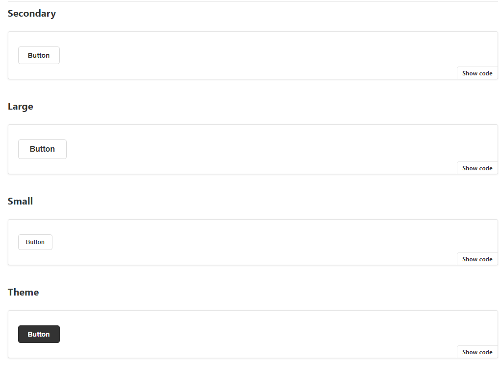

## storybook 使用 （react-create-app ts篇）

*我是 npm 的 搬运工*

    只谈使用

    storybook 版本6.5

Storybook is an open source tool for building UI components and pages in isolation. It streamlines UI development, testing, and documentation.

---

### storybook 安装

[快速查看](https://storybook.js.org/docs/react/get-started/install)

1.create-react-app xxx --template typescript
2.npx storybook init
3.npm run storybook 

    初始化后目录结构类似如下
    │  header.css
    │  Header.stories.tsx
    │  Header.tsx
    │  Introduction.stories.mdx
    │  page.css
    │  Page.stories.tsx
    │  Page.tsx
    │  
    ├─assets
---
    优化目录结构更加清晰

    ├─assets
    │
    ├─Button
    │      index.css
    │      index.stories.tsx
    │      index.tsx
    │
    └─Card
            index.css
            index.stories.tsx
            index.tsx

[npm run storybook](https://storybook.js.org/videos/storybook-hero-video-optimized-lg.mp4)

    执行以上命令后，界面如上连接一致
---

#### 如何去编写一个公共UI组件 ?

    以自定义的一个 Card 组件为例 （Card.tsx）

    首先 组件对应的 props 类型通过 interface  对应上图左侧编写，再映射到右侧的 storybook 中

    ?: 可以表示是否带 * 号，是否必须
    /**/: 里的内容作为该字段的描述
    冒号右侧代表属性的类型

    上图中还有 default ,以及 control 属性下面再继续讲
---

    default 值可以在组件 props 入参时赋初始值则代表其默认值
    control 为你所提供操作的能力，是 storybook 赋能的，可以对该属性赋上你想要的参数并查看该组件的表现

#### 目录层级

[快速查看](https://storybook.js.org/docs/react/writing-stories/naming-components-and-hierarchy)

**Default export**

    The default export metadata controls how Storybook lists your stories and 
    provides information used by addons. For example, here’s the default export
    for a story file Component.stories.js:

    当你在 xxx.stories.js 文件的 export default 中如上图编写后目录层级也就出来了

#### 组件示例

    如果你想多样化展示你的组件属性，如下这般：

[快速查看](https://storybook.js.org/docs/react/writing-stories/introduction)
How to write stories 中有谈及

    你可以有以下两种方式编写

    如果你对 MDX 版感兴趣，可异步官网了解

---

    以上信息，基本可以帮助你快速应用上 storybook